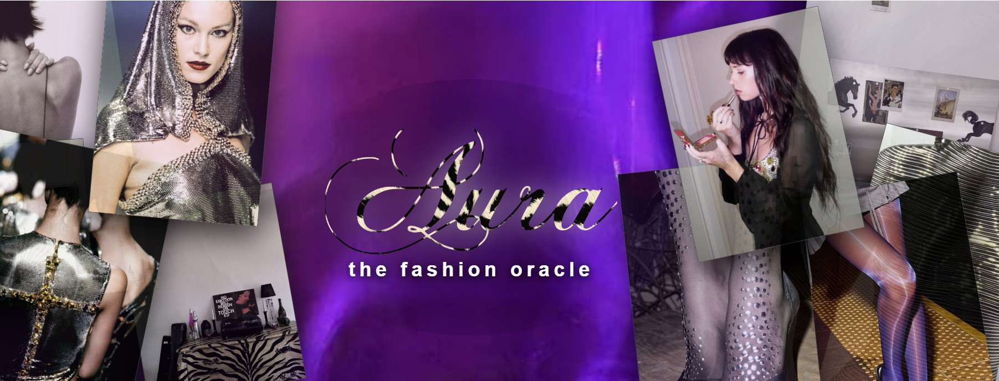

# 🔮 Aura — The Fashion Oracle

A computer-vision web app that reads the **chromatic DNA** of a fashion photograph.

Upload a runway or street-style image. Aura segments the silhouette, extracts the
dominant colours of each detected region, and hands that structured analysis to an
LLM that will discuss the look with you — grounded in the actual pixels, not in a
vague description of the image.

---

## ✨ What it does

| | |
|---|---|
| 🎯 **Segment** | YOLOv8 instance segmentation isolates each region of the photograph |
| 🎨 **Extract** | K-means clustering over the masked pixels returns the dominant colours, with the share each one occupies |
| 💬 **Interpret** | The hex values and region labels are passed as context to an LLM styled as a fashion oracle |

---

## 🛠 Stack

`Python` · `Streamlit` · `YOLOv8 (Ultralytics)` · `OpenCV` · `scikit-learn` · `OpenAI API`

---

## ⚙️ How it works

1. **Segmentation** — `yolov8n-seg` runs with `retina_masks=True`, returning masks at
   the image's native resolution so no rescaling artefacts corrupt the colour sampling.
2. **Colour extraction** — pixels under each mask are clustered with K-means (k=3).
   Large images are randomly subsampled to 20,000 pixels, which is statistically
   indistinguishable for dominant-colour extraction and keeps the app responsive.
3. **Context building** — the region labels and hex codes are serialised into a text
   block and injected into the LLM's system prompt.
4. **State management** — Streamlit re-executes the entire script on every interaction,
   so the vision pipeline is guarded by a file-identity check and its results cached in
   `session_state`. Computation and rendering are kept in separate functions.

---

## ⚠️ Known limitation

The segmentation model is `yolov8n-seg`, trained on **COCO** — a dataset of 80 generic
classes that contains no garments. In practice it detects `person`, `handbag` or `tie`,
never `dress` or `jacket`, so the palettes describe *regions* rather than individual
items of clothing.

Replacing it with a checkpoint fine-tuned on **DeepFashion2** or **Fashionpedia**, or
adding a human-parsing model for upper-body / lower-body separation, is the next step.

---

## 🚀 Run locally

```bash
git clone https://github.com/nicbelelli/aura.git
cd aura
pip install -r requirements.txt
```

Add your OpenAI key:

```bash
mkdir -p .streamlit
echo 'OPENAI_API_KEY = "sk-..."' > .streamlit/secrets.toml
```

Then:

```bash
streamlit run app.py
```

The app runs without a key too — segmentation and colour extraction work offline,
only the conversational layer is disabled.

The YOLO weights (~7 MB) download automatically on first launch.

---

## 🖼 Assets

Collage images live in `assets/`. The app picks up any `.jpg` / `.png` it finds there,
so you can swap the whole visual identity by changing the folder contents. Filenames
containing `sfondo`, `zebrato`, `usericon`, `boticon` or `readme` are reserved for the
theme and excluded from the collage.

All photographs in this repository are my own.

---

## ☁️ Deployment

`packages.txt` installs `libgl1`, required by OpenCV on Streamlit Community Cloud.
Without it the app crashes on import. Set `OPENAI_API_KEY` through the app's
**Secrets** panel rather than committing it.

---

Built by [Nicole Belelli](https://linkedin.com/in/nicolebelelli) 🖤
